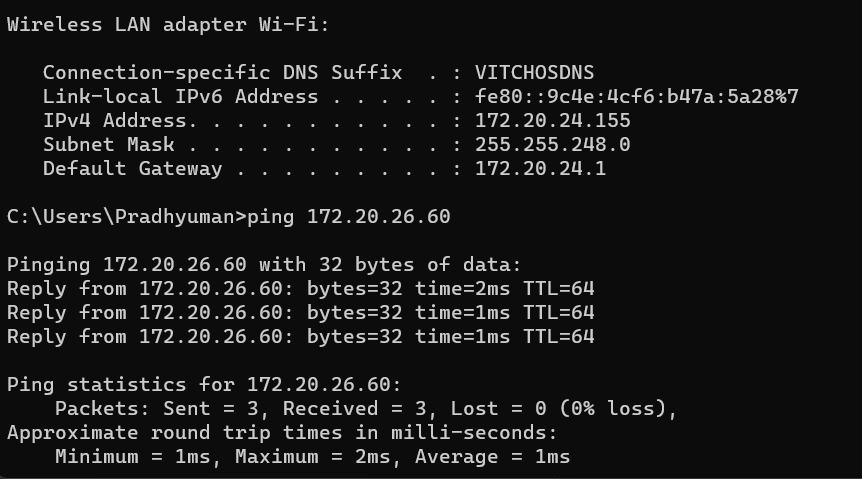
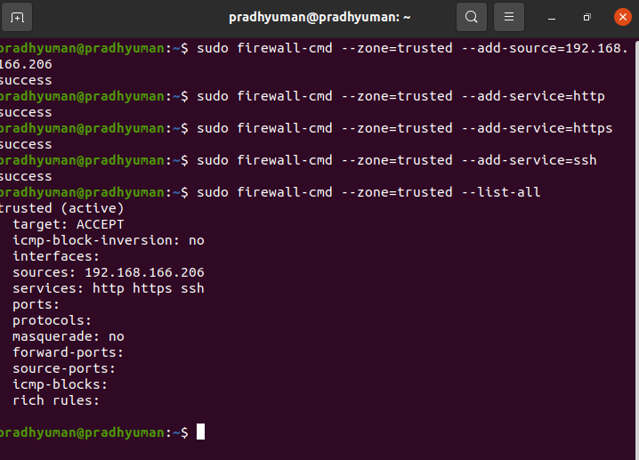

# TASK
## Introduction 
Task involves setting up and configuring a firewall using Firewalld with nftables on a Linux virtual machine. The task specifies the use of three zones: trusted-zone, internal-zone, and public-zone.

### Zones
The firewalld service handles rule groups through entities known as zones. These zones consist of rules that determine which traffic is permitted based on the level of trust in the network. By assigning network interfaces to specific ```zones```, the firewall governs the allowed behavior accordingly.

### Rule Permanence
In Firewalld, rules can either be applied to the active runtime ruleset or be set as permanent. By default, when adding or modifying a rule, it only affects the current running firewall configuration. However, after the next system reboot or reload of the firewalld service, only the permanent rules will persist.

For most operations using the firewall-cmd command, you can include the ```--permanent``` flag to specify that the changes should be applied to the permanent configuration.

### Installing and Enabling firewall

```sudo apt update```

```sudo apt install firewalld nftables```

After the firewall is installed , the service needs to be enabled using ```systemctl```

```sudo systemctl enable firewalld```

```sudo systemctl start firewalld```

To verify if the service is up an running use 
```sudo firewall-cmd --state```

### Configuring 
According to problem statement I need to use `trusted-zone` , `internal-zone`, and `public-zone`.

#### Getting Information 

To see a list of available zones we can use `firewall-cmd --get-zones`
We can find the above said zones in the available zones.

To see the specific configuration associated with the zone we can use 
sudo firewall-cmd --zone='zone-name' --list-all

#### Configuring
- My Laptop IP
'

- Working with ```trusted-zone```

I am going to configure my firewall in such a way that `trusted-zone` can allow my laptop ip for ```ssh service``` using port ```22/tcp```

- Command used

```sudo firewall-cmd --zone=trusted --add-source=172.20.26.155```
```sudo firewall-cmd --zone=trusted --add-service=ssh```
```sudo firewall-cmd --zone=trusted --add-port=22/tcp```
```sudo firewall-cmd --zone=trusted --list-all```


